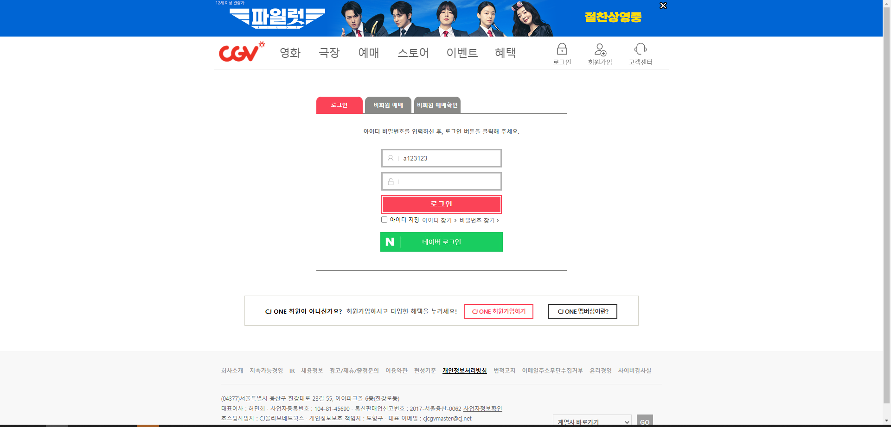
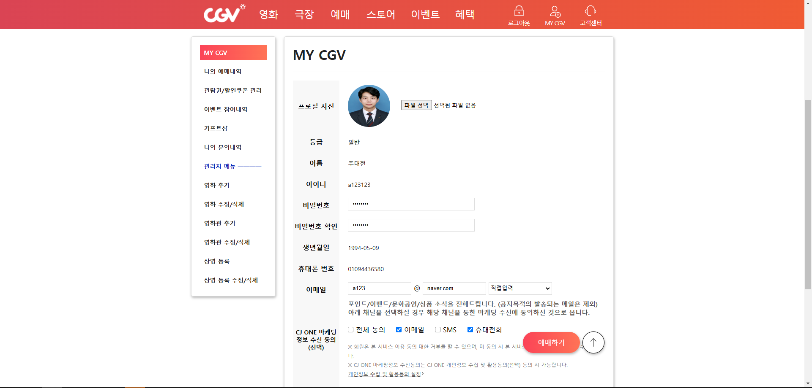
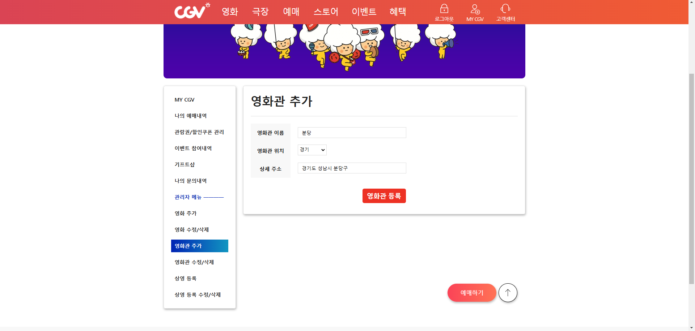
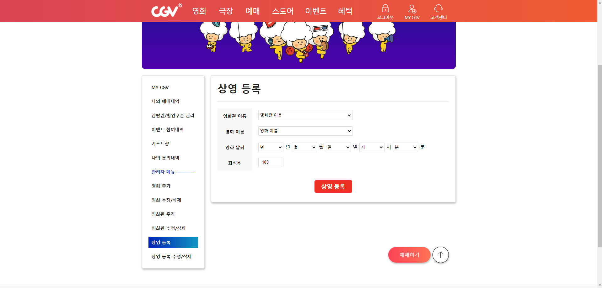
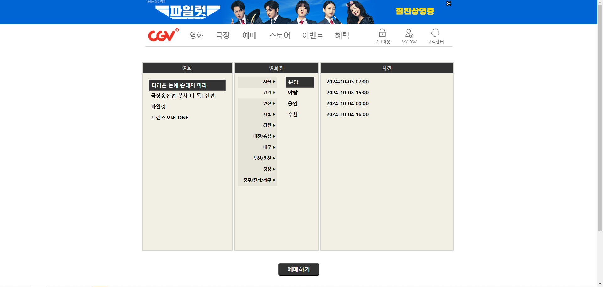

# cgv-springboot-project

## 🖥️ 프로젝트소개
기존 cgv 홈페이지에서 디자인을 바꿔 구현한 풀스택 프로젝트입니다.

## 🕰️ 개발 기간
2024.08 ~ 2024.09

### 🧑‍🤝‍🧑 개발 인원
개인 프로젝트

### ⚙️ 개발 환경
- **Language** : Java 11
- **IDE** : STS4
- **Framework** : SpringBoot 2.6.7
- **Database** : MariaDB 10.6.12
- **ORM** : Mybatis 2.2.0

## 📌주요 기능

- **메인 화면**

 

- **네비게이션 구현**

 

- **로그인**

 

- **MY CGV**

 

- **영화 추가**

 

- **영화관 등록**

 

- **상영 등록**

 

- **등록된 영화 목록**

 

- **영화 상세 페이지**

 

- **예매 페이지**

 
